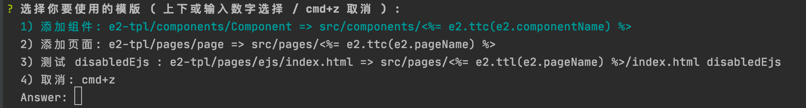
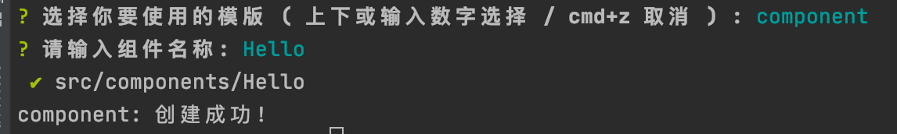

# e2-cli

Compile any file with ejs!

[![npm package][npm-badge]][npm-url]
[![npm downloads][npm-downloads]][npm-url]
[![github][git-badge]][git-url]

[npm-badge]: https://img.shields.io/npm/v/e2-cli.svg
[npm-url]: https://www.npmjs.org/package/e2-cli
[npm-downloads]: https://img.shields.io/npm/dw/e2-cli
[git-url]: https://github.com/ziven27/e2-cli
[git-badge]: https://img.shields.io/github/stars/ziven27/e2-cli.svg?style=social





## 安装

```bash
$ npm install -g e2-cli
```

## 使用

```bash
$ npx e2-cli
```

首次使用会创建两个文件和一个文件夹。

- **e2.config.json**: 配置文件，用户存放模版和数据
- **.e2.data.json**: 每个人独立的数据文件（需要添加到 .gitignore）
- **e2-tpl**: 默认模版文件，可以按照需求自由定制

## 基础模版

```JSON
/* e2.config.json */
{
  "component": {
    /* 非必须，会在模版列表显示， ${_description || component} */
    "_description": "添加组件",
    /* 非必须，ejs 编译的时候会附加到 e2 作用域下 */
    "_data": {},
    /* 非必须，需要用户输入的数据 */
    "_ask": [
      {
        "message": "请输入组件名称:",
        "name": "componentName"
      }
    ],
    /* 必须，模版列表 */
    "template": [
      {
        /* 是包含 . 开头的文件 */
        "dot": "false | true",
        "from": "e2-tpl/components/Component",
        "to": "src/components/<%= e2.componentName %>"
      }
    ]
  }
}
```

在 `npx e2-cli` 命名的时候会在模版列表里面看到 `component` 选项，选择即可使用。

使用之后会将 `from` 文件或文件夹通过 ejs 编译到 `to` 目录下。 `from` 和 `to` 内也可以使用 ejs 语法。

需要询问用户数据的信息，可以在 `_ask` 里面配置，具体语法可以参考 [inquirer](https://www.npmjs.com/package/inquirer). 

所以 ejs 中的数据会同时有 `{..._data, ..._ask }` 。


## 数据源

```JSON
/* e2.config.json */
{
  "_data": {
    "version": "1.0.0",
    "authorName": "undefined"
  },
  "component": "/* others */"
}
```

```JSON
/* .e2.data.json */
{
  "authorName": "你的名字"
}
```

在 `e2.config.json` 的一级目录下的 `_data` 和 `.e2.data.json` 的数据会被合并之后附加到所有模版的数据中。

`.e2.data.json` 不一样的地方区别在于同一个项目，不同的用户拥有不同的数据，需要添加到 `.gitignore`.

### 内置数据

- `<%= e2.date %>`: 使用模版时候的日期
- `<%= e2.ttc() %>`: 首字母大写 （`text-transform: capitalize;`）
- `<%= e2.ttl() %>`: 全小写 (`text-transform: lowercase;`)

所有最后在 ejs 中的数据实际为： 

```
{
    ...'内置数据', 
    ...'e2.config.json._data', 
    ...'.e2.data.json', 
    ...'e2.config.json[templateName]._data', 
    ...'e2.config.json[templateName]._ask'
}
``` 
