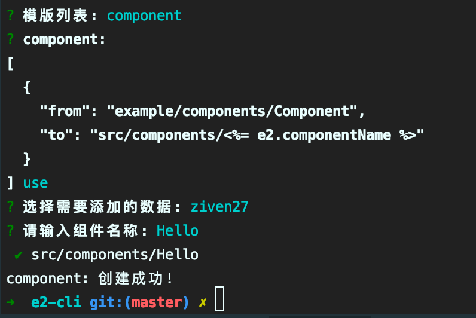

# e2-cli

Compile any file with ejs!

[![npm package][npm-badge]][npm-url]
[![npm downloads][npm-downloads]][npm-url]
[![github][git-badge]][git-url]

[npm-badge]: https://img.shields.io/npm/v/e2-cli.svg
[npm-url]: https://www.npmjs.org/package/e2-cli
[npm-downloads]: https://img.shields.io/npm/dw/e2-cli
[git-url]: https://github.com/ziven27/e2-cli
[git-badge]: https://img.shields.io/github/stars/ziven27/e2-cli.svg?style=social




## install

```bash
$ npm install e2-cli --save-dev
$ npx es-cli
```

## config

```JSON
{
  "_data": {
    /* global data */
    "default": {
      "version": "1.0.0"
    },
    /* you can select one of them when compile template */
    "user1": {
      "authorName": "user1"
    },
    "user2": {
      "authorName": "user2"
    }
  },
  "component": {
    /* just in this template */
    "_data": {
      "tplName": "component"
    },
    /* ask user to input something */
    "_ask": [
      {
        "message": "请输入组件名称:",
        "name": "componentName"
      }
    ],
    "template": [
      {
        "from": "example/components/Component",
        "to": "src/components/<%= e2.componentName %>"
      }
    ]
  },
  "page": {
    "_data": {
      "tplName": "page"
    },
    "_ask": [
      {
        "message": "请输入页面名称:",
        "name": "pageName"
      }
    ],
    "template": [
      {
        "from": "example/pages/index.html",
        "to": "src/pages/<%= e2.pageName %>/index.html",
        "disabledEjs": true
      }
    ]
  }
}
```

```js
const DATA_PRIVATE = {
  /* 日期对象 */  
  date: new Date().toLocaleDateString(),
  /* text-transform: capitalize; */
  ttc: function (str = '') {
    return str.charAt(0).toUpperCase() + str.slice(1).toLowerCase();
  },
  /* text-transform: lowercase; */
  ttl: function (str = '') {
    return str.toLowerCase();
  }
};
```

the ejs data from `{...DATA_PRIVATE,..._data.default,..._data.user1, ...component._data, ...component._ask }`.

the `_data.user1` is optional in `e2-cli`.

the `_ask` is based on [inquirer](https://www.npmjs.com/package/inquirer).

data scope is `e2`, so you can set ejs data `<%= e2.authorName %>`.

## API

| key                                   | function                                 |
| ------------------------------------- | ---------------------------------------- |
| `_data`                               | globalData (each ejs will got this data) |
| `\[tplName\]._tip`                    | tips of template                         |
| `\[tplName\]._ask`                    | get data from user for current template  |
| `\[tplName\]._data`                   | data for current template                |
| `\[tplName\].template`                | template                                 |
| `\[tplName\].template[{disabledEjs}]` | disabledEjs in this template             |


