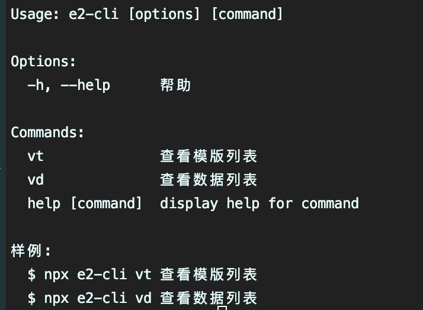

# e2-cli



Compile any file with ejs

## install

```bash
$ npm install e2-cli -g
$ es-cli
```

## config

```JSON
{
  "_data": {
    "default": {
      "version": "1.0.0"
    },
    "user1": {
      "authorName": "user1"
    },
    "user2": {
      "authorName": "user2"
    }
  },
  "component": {
    "_data": {
      "tplName": "component"
    },
    "_ask": [
      {
        "message": "请输入组件名称:",
        "name": "componentName"
      }
    ],
    "template": [
      {
        "from": "example/components/Component",
        "to": "src/components/<%= data.componentName %>"
      }
    ]
  },
  "page": {
    "_data": {
      "tplName": "page"
    },
    "_ask": [
      {
        "message": "请输入页面名称:",
        "name": "pageName"
      }
    ],
    "template": [
      {
        "from": "example/pages/index",
        "to": "src/pages/<%= data.pageName %>"
      }
    ]
  }
}
```

```js
const DATA_PRIVATE = {
  date: new Date().toLocaleDateString(),
};
```

the ejs data from `{...DATA_PRIVATE,..._data.default,..._data.user1, ...component._data, ...component._ask }`.

the `_data.user1` is optional in `e2-cli`.

the `_ask` is based on [inquirer](https://www.npmjs.com/package/inquirer).
